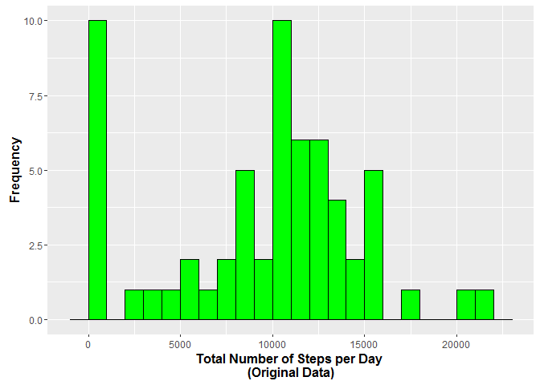
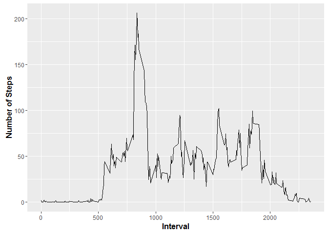
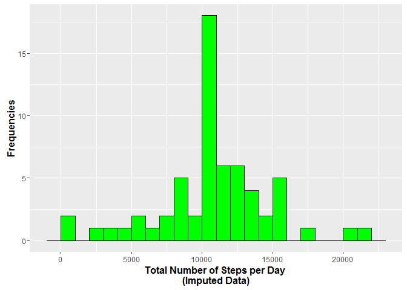
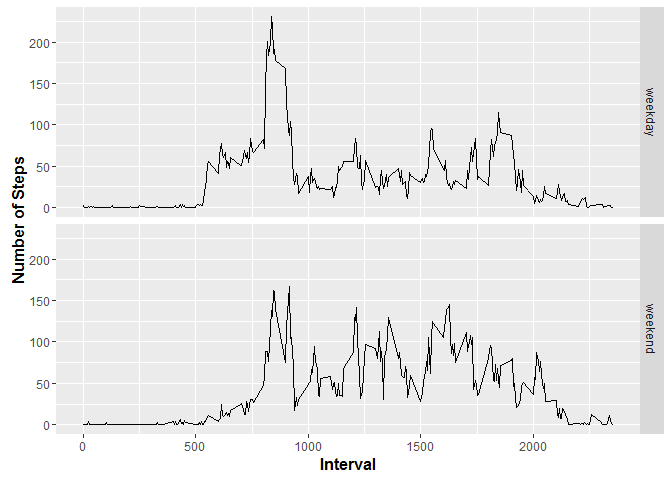

# Reproducible Research: Peer Assessment 1


## Loading and preprocessing the data
The raw data is loaded into the dataframe rawdata. No further preprocessing is needed.

```r
rawdata <- read.csv("activity.csv")
```

## What is mean total number of steps taken per day?
For this question the following calcuations are done:
- Aggregation of total number of steps per day
- Drawing of a equivalent histogramm
- Computing mean and median of total steps per day


```r
part2data <- aggregate(rawdata$steps, by = list(rawdata$date), FUN = sum, na.rm = TRUE)
names(part2data) <- c("date", "steps")
library(ggplot2)
```

```
## Warning: package 'ggplot2' was built under R version 3.2.3
```

```r
# Histogramm
qplot(part2data$steps, binwidth = 1000) + 
	xlab("Total Number of Steps per Day \n(Original Data)") +
	ylab("Frequencies") +
	theme(axis.title = element_text(face = "bold", size = 12)) +
	geom_histogram(color = "black", fill = "green", binwidth = 1000)
```



```r
# mean and median of the total number of steps taken per day
x <- summary(part2data$steps)
print(x[c("Mean", "Median")])
```

```
##   Mean Median 
##   9354  10400
```


## What is the average daily activity pattern?
Following steps are executed:   
- Calculation of the average steps per intervall across all days
- Detection of the interval(s) containing the maximal number of steps


```r
# Daily Activities
part3data <- aggregate(rawdata$steps, by = list(rawdata$interval), FUN = mean, na.rm = TRUE)
names(part3data) <- c("interval", "steps")
ggplot(part3data, aes(x = interval, y = steps)) + geom_line()
```



```r
maxvalue <- max(part3data$steps)
maxinterval <- subset(part3data, steps == maxvalue)
print(maxinterval)
```

```
##     interval    steps
## 104      835 206.1698
```


## Imputing missing values   
First the number of missing values is computed:

```r
# Calculate total number of missing values
library(sqldf)
```

```
## Warning: package 'sqldf' was built under R version 3.2.3
```

```
## Loading required package: gsubfn
```

```
## Warning: package 'gsubfn' was built under R version 3.2.3
```

```
## Loading required package: proto
```

```
## Warning: package 'proto' was built under R version 3.2.3
```

```
## Loading required package: RSQLite
```

```
## Warning: package 'RSQLite' was built under R version 3.2.3
```

```
## Loading required package: DBI
```

```
## Warning: package 'DBI' was built under R version 3.2.3
```

```r
countNAs <- sqldf("SELECT COUNT(*) FROM rawdata WHERE steps is NULL")
```

```
## Loading required package: tcltk
```

```r
print(countNAs)
```

```
##   COUNT(*)
## 1     2304
```
The dataset part3data contains the average steps per intervall across all days. So my impute strategy
is to replace the missing value in a special interval with the average of this interval across all days. One
effect of this strategy is that a day like October, 1st with missing values everywhere will contain much more steps
than before, while October, 2nd with almost only zeroes remains unchanged.

Following steps are executed:  
- Merge of the raw data with the average steps per interval   
- Replacement of missing values   
- Aggregation across all intervals to determine the total steps per day   


```r
# Daily Activities
# Impute missing values
tmp <- merge(rawdata, part3data, by.x = "interval", by.y = "interval")
where <- is.na(tmp$steps.x)
tmp$steps.x[where] <- tmp$steps.y[where]
# Aggregate imputed data
part4data <- aggregate(tmp$steps.x, by = list(tmp$date), FUN = sum)
# Rename columns
names(part4data) <- c("date", "steps")
```
Afterwards the histogram is generated

```r
# Histogramm of imputed data
qplot(part4data$steps, binwidth = 1000) + 
	xlab("Total Number of Steps per Day \n(Imputed Data)") +
	ylab("Frequencies") +
	theme(axis.title = element_text(face = "bold", size = 12)) +
	geom_histogram(color = "black", fill = "green", binwidth = 1000)
```


Finally the mean and median values of the imputed data are computed:

```r
# mean and median of the total number of steps taken per day of imputed data
ximp <- summary(part4data$steps)
print(ximp[c("Mean", "Median")])
```

```
##   Mean Median 
##  10770  10770
```
So the impact is that there are much fewer days with total steps near zero and more days with circa 10000 steps totally. Therefore, mean and median are higher (and in this case the same).

## Are there differences in activity patterns between weekdays and weekends?
For this analysis the dataset tmp with imputed data is taken as input for the dataset 
data5input which contains the information about weekday / weekend. As the analysis is
made in Germany I had to use the german names of the days.

```r
# Determine part of week
part5input <- tmp[, 1:3]
part5input$partofweek <- as.factor(ifelse(weekdays(as.Date(part5input$date)) 
	%in% c("Samstag", "Sonntag"), "weekend", "weekday")) 
part5data <- aggregate(part5input$steps.x, by = list(part5input$interval, part5input$partofweek), FUN = mean)
# Rename columns
names(part5data) <- c("interval", "partofweek", "steps")
```
On base of this data the time series plot is generated:

```r
# Generating the plot
#qplot(interval, steps, data = part5data, facets = . ~ partofweek) + geom_line()
qplot(interval, steps, data = part5data) + geom_line() + 
	facet_grid(partofweek ~ .) 
```


